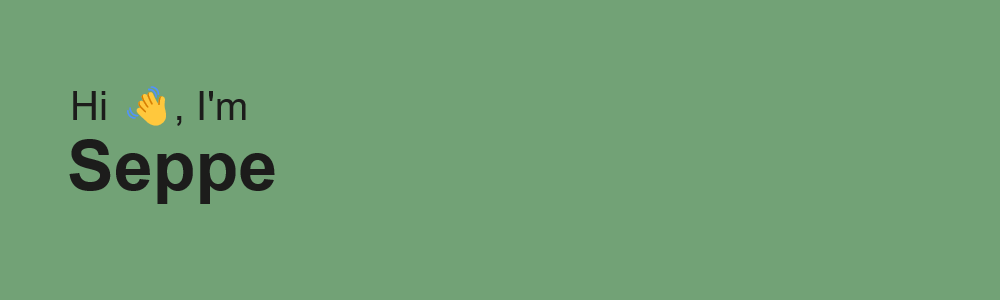
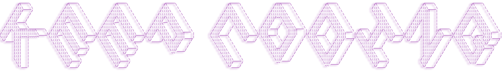

- 🌱 I’m currently learning alot of stuff honestly, but mainly playing Vue and Flutter projects
- 🥅 2024 Goals: Contribute more to Open Source projects
- ⚡ Fun fact: I love to make my own PCB designs and IoT projects

## 🌐 Socials:
   

 

### Languages and Tools:

 

### Other interests/services:

 

# 📊 GitHub Stats:

 

[linkedin]: https://www.linkedin.com/in/seppe-geerinckx-30b236156/

---

 
 

